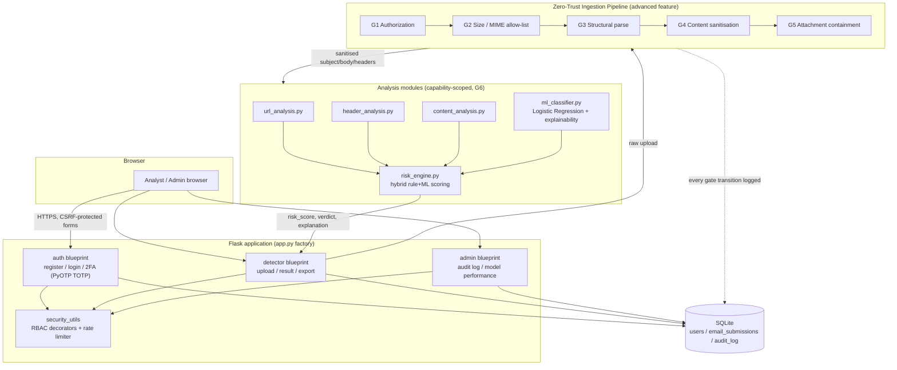
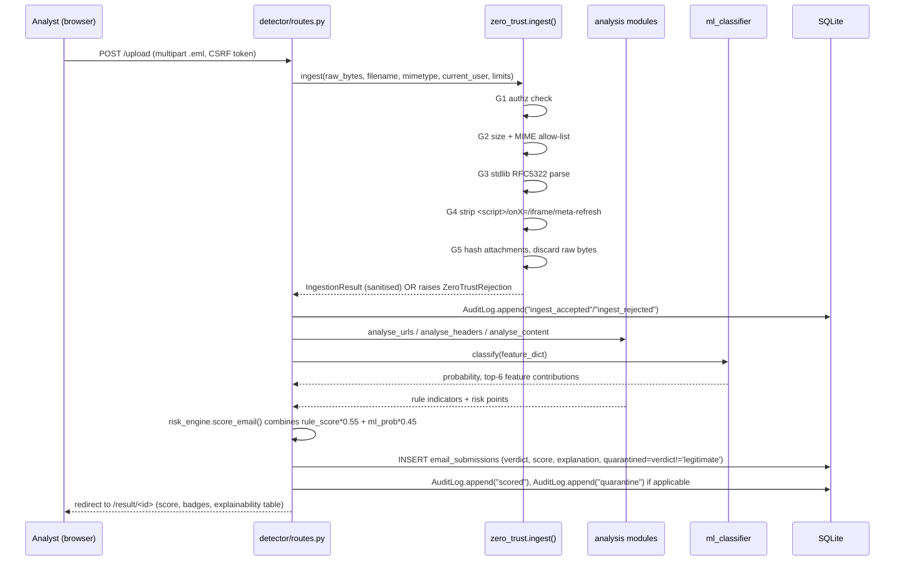
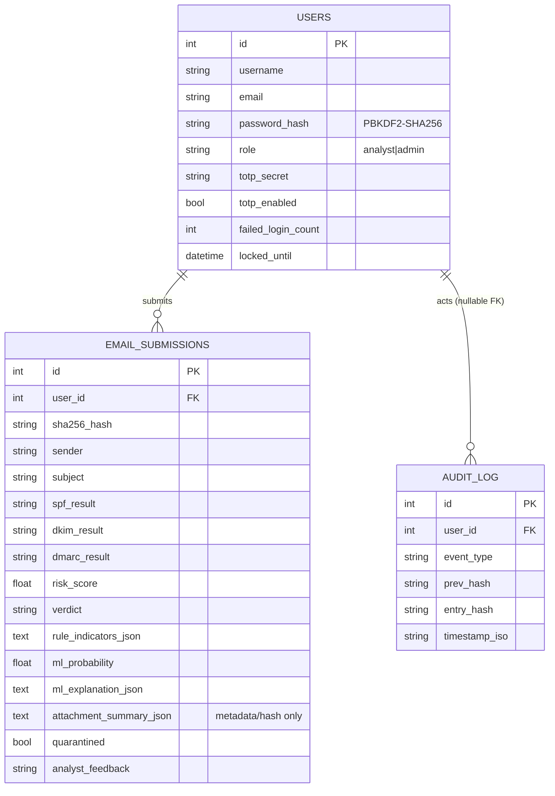

# Architecture — Explainable Phishing Email Detector

## Component architecture

## Data-flow: one email submission, end to end

## Database schema (entity summary)

## Trust zones

| Zone | Contains | Trust level |
|---|---|---|
| Browser | Analyst/admin UI | Untrusted (CSRF, session-hijack surface) |
| Flask app layer | Blueprints, RBAC decorators | Trusted, but every input from Browser or Email zones is validated before use |
| **Email content zone** | Anything inside an uploaded `.eml`/`.txt` | **Always untrusted** — this is the Zero-Trust boundary; nothing here is executed, rendered, or trusted regardless of source |
| Database | SQLite via SQLAlchemy ORM | Trusted only via parameterised access; never receives raw email bytes or raw SQL |

## Why Logistic Regression over a black-box model

The brief requires an **explainability view showing the features/indicators
that influenced the risk score**. A linear model's per-prediction
explanation (`contribution = coefficient × standardised_value`) is *exact*,
not a post-hoc approximation — this is a direct, defensible way to satisfy
that requirement without introducing a separate explainability library
(SHAP/LIME), while still combining with independent rule-based indicators
in `risk_engine.py` for defence-in-depth against a single model being
gamed (see `docs/threat_model.md`, item 11).
